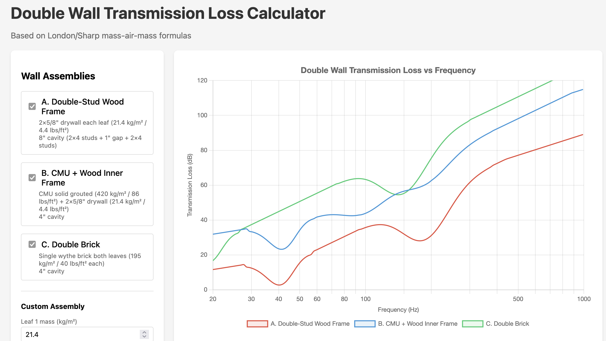

# Forum Post: Wall Assembly Sanity Check

**Target forums:** 
- John Sayers Recording Studio Design Forum (johnlsayers.com)
- Gearspace (formerly GearSlutz)
- Reddit: r/audioengineering, r/buildastudio, r/drums, r/soundproof

**Status:** Posted

**Posted to:**
- [r/Acoustics](https://www.reddit.com/r/Acoustics/comments/1qn1he2/sanity_check_wall_assembly_options_for_backyard/) - 2026-01-25
- [r/buildastudio](https://www.reddit.com/r/buildastudio/comments/1qn1ml4/sanity_check_wall_assembly_options_for_backyard/) - 2026-01-25

---

## Title

Sanity check: Wall assembly options for backyard drum studio (targeting 70 dB at property line)

---

## Post Body

I'm planning a detached backyard drum studio (new construction, room-within-a-room design) and want to sanity-check my wall assembly options before committing. I've done the research but the theoretical transmission loss calculations I'm running seem pessimistic compared to what I see in successful builds online.

### Project Goals
- **Primary use:** Acoustic drum practice and recording
- **Location:** Residential backyard (Texas), ~30 ft from property line
- **Foundation:** Concrete slab (no floating floor planned)
- **Roof/ceiling:** TBD - haven't finalized assembly yet
- **Noise constraint:** City ordinance limits:
  - Daytime (7 AM - 10 PM): 70 dB(A) / 80 dB(C) at property line
  - Nighttime (10 PM - 7 AM): 50 dB(A) / 60 dB(C) at property line
  - I plan to play during daytime only, so targeting the 70 dB(A) / 80 dB(C) limit
- **Source level:** Acoustic drums typically produce 105-115 dBC (I'm using 110 dBC as my design reference)
- **Background noise:** 60 dBC (confirmed measurement, calm day)
- **Required isolation:** 50 dB minimum (110 - 60 = 50), targeting 55 dB for safety margin

### The Concern
I'm particularly worried about **kick drum frequencies (40-80 Hz)**. My understanding is that double-wall systems have a mass-spring-mass resonance frequency where isolation drops, and I want to make sure whichever assembly I choose doesn't have its resonance right in the kick drum range.

### Options I'm Considering

**Approach A: Decoupled Double Stud Wood Frame (Rod Gervais style)**
- Outer leaf: 2×4 studs + 2× 5/8" drywall (~21.4 kg/m² / 4.4 lbs/ft²)
- Inner leaf: 2×4 studs + 2× 5/8" drywall (~21.4 kg/m² / 4.4 lbs/ft²)
- Cavity: 8" total (3.5" outer stud + 1" gap + 3.5" inner stud), filled with mineral wool
- Estimated resonance: ~41 Hz

**Approach B: CMU Outer Shell + Decoupled Wood Inner Frame**
- Outer leaf: 8" CMU solid grouted (~420 kg/m² / 86 lbs/ft²)
- Inner leaf: 2×4 studs + 2× 5/8" drywall (~21.4 kg/m² / 4.4 lbs/ft²)
- Cavity: 4" air gap with mineral wool
- Estimated resonance: ~42 Hz

**Approach C: Double Brick**
- Outer leaf: Single wythe brick (~195 kg/m² / 40 lbs/ft²)
- Inner leaf: Single wythe brick (~195 kg/m² / 40 lbs/ft²)
- Cavity: 4" air gap
- Estimated resonance: ~19 Hz

### My Calculations

I built a simple transmission loss calculator using the London/Sharp mass-air-mass formulas. The graph below shows estimated TL across the frequency spectrum for each approach:

According to this, Approach A (double-stud wood) shows a resonance dip right around 40 Hz, while B performs similarly but with more mass (thus more isolation), and C's resonance is well below the kick drum range.

**But here's my confusion:** Countless drum studios have been built successfully with double-stud wood construction (Approach A), and Rod Gervais specifically recommends it. Are my theoretical calculations missing something? It seems that the isolation right at the kick drum frequencies for approach A are basically negligible. It doesn't look like it would drop that specific frequency to my target.

### Questions
1. For those who've built studios with double-stud wood: did you have issues with kick drum isolation, or does it work fine in practice?
2. Given my 70 dB daytime limit, would Approach A be sufficient, or should I consider the heavier masonry options?
3. What am I missing here? There has to be something here given all the studios I've seen built with this approach with great results.

Thanks for any insights!

---

## Checklist Before Posting

- [x] Screenshot of transmission loss graph attached
- [x] Drum SPL range verified (105-115 dBC)
- [x] Distance to property line included (~30 ft)
- [x] Foundation mentioned (concrete slab)
- [x] Roof/ceiling status mentioned (TBD)
- [x] Floating floor status mentioned (none planned)
- [x] Daytime AND nighttime noise limits included
- [x] Review for clarity and tone before posting

---

## Notes

- Nighttime limit is 50 dB(A) / 60 dB(C) - much stricter, but not planning to play at night
- This is new construction (not retrofit) which gives more flexibility
- Green Glue between drywall layers is planned but not mentioned in post (keep it focused on wall assembly choice)
