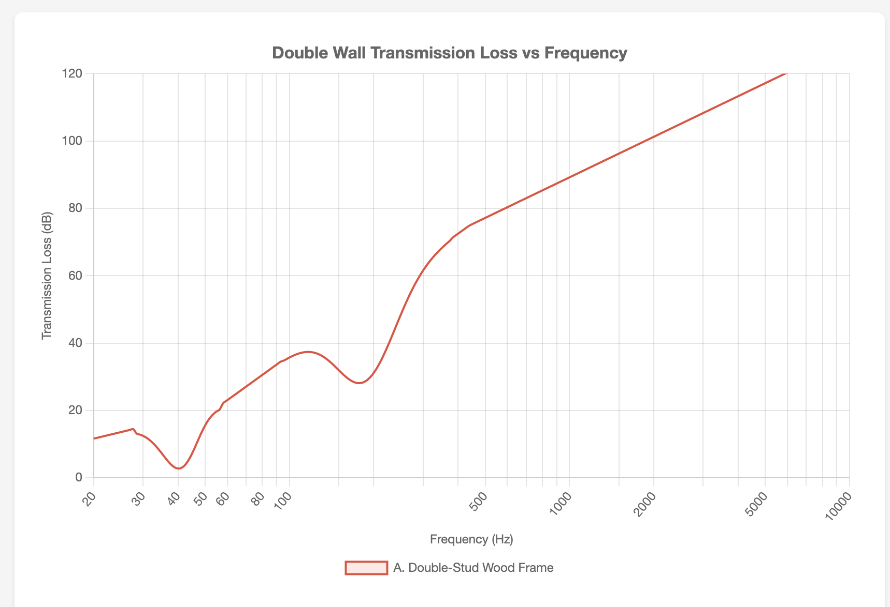
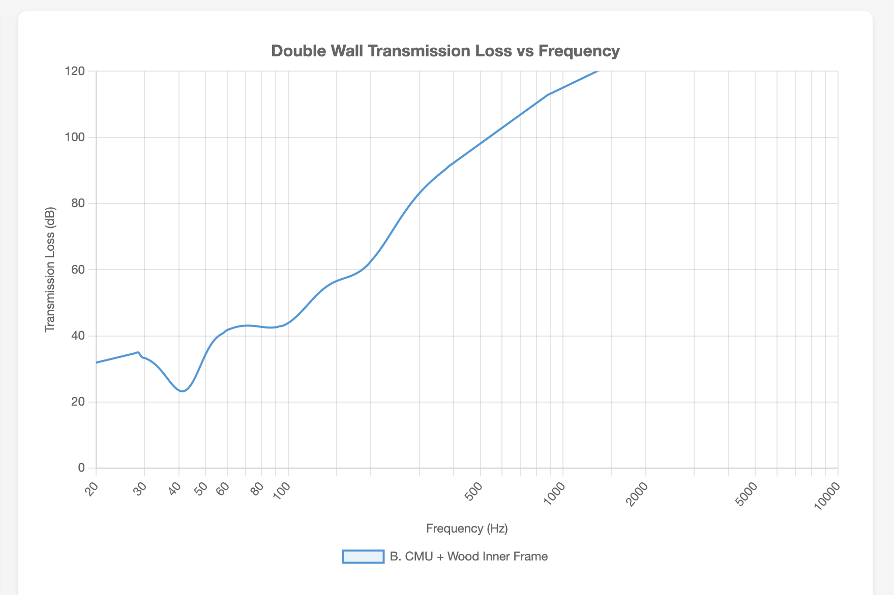
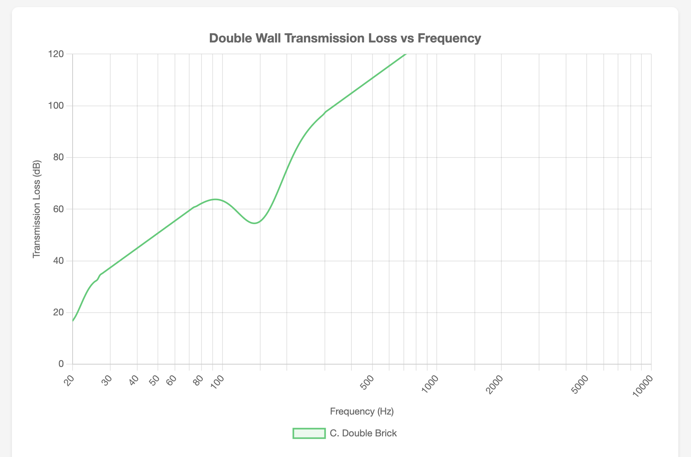

# Wall Assembly Options Analysis

*Related tasks: 2.1, 2.2, 2.3, 2.4, 2.5, 3.1, 3.2, 3.3, 3.4*

This project requires a **room-within-a-room (RWAR)** design - a double-leaf system where the inner room is completely decoupled from the outer shell. This provides the isolation needed for drum practice and recording.

---

## Understanding Leaf Systems

- **Single leaf**: One layer (standard wall) - insufficient for sound isolation
- **Double leaf**: Two decoupled layers with air gap - what we need
- **Triple leaf**: Three layers - generally avoided as the middle layer can create resonance problems

---

## Double Wall Resonance

A double-leaf wall system behaves as a mass-spring-mass system where:
- Each wall leaf acts as a mass
- The air cavity between them acts as a spring

At the **resonance frequency**, the system actually performs *worse* than a single wall of equivalent mass—sound passes through more easily because the air spring couples the two masses together.

**Critical insight for drums:** Below the resonance frequency, isolation drops off rapidly. Above it, isolation improves at 12-18 dB/octave (vs 6 dB/octave for single walls). For kick drum isolation (40-80 Hz), we need the resonance frequency as low as possible—ideally below 40 Hz.

**How to lower resonance frequency:**
1. **Increase mass** of one or both leaves (heavier walls = lower resonance)
2. **Increase cavity depth** (wider air gap = lower resonance)
3. **Add insulation** in cavity (dampens the spring effect, reduces the resonance peak)

See [Reference: Double Wall Resonance Theory](#reference-double-wall-resonance-theory) for detailed formulas.

---

## Mass Law

The **mass law** describes how a wall's mass affects its sound transmission loss (TL). The basic principle:

> **Doubling the mass increases TL by ~6 dB**

For a single wall, the theoretical mass law is:
```
TL = 20 × log₁₀(f × m) - 47 dB
```
Where:
- `f` = frequency (Hz)
- `m` = surface mass density (kg/m²)

**Key implications:**
- Heavier walls block more sound at all frequencies
- Higher frequencies are easier to block than lower frequencies
- To block low frequencies (kick drum), you need significant mass

### Mass Law for Double Walls

A double wall behaves differently depending on frequency relative to the resonance frequency (f₀):

| Frequency Range | Behavior | TL Improvement Rate |
|-----------------|----------|---------------------|
| Below resonance (f < f₀) | Leaves move together as one mass | 6 dB/octave (like single wall) |
| At resonance (f ≈ f₀) | Air spring couples masses — **worse** than single wall | Loss of 10-20 dB |
| Above resonance (f > f₀) | Decoupling works — this is where double walls shine | **18 dB/octave** |
| Above limit frequency (f > 55/d) | Cavity modes dominate | ~12 dB/octave |

Above the resonance frequency, the transmission loss for a double wall is approximately:
```
TL ≈ TL₁ + TL₂ + 20 × log₁₀(f × d) - 29 dB
```
Where:
- `TL₁`, `TL₂` = mass law TL for each leaf individually
- `d` = cavity depth (meters)

This 18 dB/octave improvement (vs 6 dB/octave for single walls) is why double walls are so effective — but only above the resonance frequency. For kick drum isolation (40-80 Hz), the resonance must be pushed as low as possible.

**Sources:**
- [Impulsion Acoustique - Double Wall Resonance](https://app.impulsion-acoustique.fr/article-double-wall-resonance) — explains the 18 dB vs 6 dB/octave difference
- Hopkins, Carl. "Sound Insulation" (2007), Chapter 4 — full London/Sharp theory derivation

### Why This Matters for Our Approaches

| Assembly | Total Mass | Relative TL Advantage |
|----------|------------|----------------------|
| Double-stud wood (2× drywall each leaf) | ~43 kg/m² (8.8 lbs/ft²) | Baseline |
| CMU + wood inner | ~441 kg/m² (90 lbs/ft²) | +20 dB theoretical |
| Double brick | ~390 kg/m² (80 lbs/ft²) | +19 dB theoretical |

The mass advantage of masonry is substantial, but double-wall decoupling provides additional isolation beyond what mass alone predicts.

---

## Cavity Insulation

Adding fibrous insulation (fiberglass or mineral wool) to the air cavity between wall leaves is standard practice, but its acoustic benefits are often overstated.

**What cavity insulation does:**
1. **Absorbs mid/high frequency sound** passing through the air cavity (~200-1000 Hz sees the largest gains, up to 8 dB)
2. **Slightly lowers resonance frequency** — changes air compression from adiabatic (γ=1.4) to isothermal (γ=1.0), shifting resonance down by ~1/3 octave
3. **Provides thermal insulation** — R-13 per stud bay adds up

**What cavity insulation does NOT do:**
- **Does not improve low-frequency isolation** — at kick drum frequencies (40-80 Hz), gains are essentially zero
- **Does not significantly affect STC** — lab tests show only 2-4 STC point improvement (empty vs. filled cavity)
- **Does not block structural vibration** — insulation only absorbs airborne sound in the cavity, not vibration through studs/framing

**Why it doesn't help at low frequencies:**
Fibrous materials can't absorb long wavelengths. At 40 Hz, the wavelength is ~28 feet — a 3.5" layer of mineral wool is acoustically invisible at that scale. The structural paths through framing dominate at low frequencies regardless of cavity treatment.

**Insulation type doesn't matter much:**
Johns Manville (manufacturer of both) states: "For both sound transmission and sound absorption, mineral wool and fiberglass are nearly identical. The tiny differences are undetectable to the human ear." Lab tests confirm this — the difference between fiberglass and mineral wool is typically 1-2 STC points, within measurement error.

**Practical recommendation:**
Use standard R-13 fiberglass batts — they're cheaper than mineral wool and perform identically for sound isolation. Completely filling the cavity provides minimal benefit over partial fill. The insulation is mandatory for thermal performance and mid-frequency absorption, but won't rescue a wall assembly that's inadequate at low frequencies.

**Sources:**
- [TM Soundproofing - Effect of Insulation in Walls](https://www.tmsoundproofing.com/effect-of-insulation-in-the-common-wall.html) — NRC Canada lab data
- [Soundproofing Company - Insulation Recommendations](https://www.soundproofingcompany.com/ask-ted/what-type-of-insulation-do-you-recommend)
- [Impulsion Acoustique - Double Wall Resonance](https://app.impulsion-acoustique.fr/article-double-wall-resonance) — isothermal vs adiabatic compression

---

## Critical (Coincidence) Frequency

Every panel has a **critical frequency** (also called coincidence frequency) where the bending wavelength in the panel matches the wavelength of sound in air. At this frequency, the panel vibrates in sync with the incident sound wave and becomes nearly acoustically transparent.

**Approximate critical frequencies:**

| Material | Thickness | fc (approx) |
|----------|-----------|-------------|
| 1/2" drywall | 12.7mm | ~2700 Hz |
| 5/8" drywall | 15.9mm | ~2200 Hz |
| 2× 5/8" drywall (glued) | 31.8mm | ~1100 Hz |
| 1/2" plywood | 12.7mm | ~2000 Hz |
| 4" concrete | 100mm | ~150 Hz |
| 8" CMU (grouted) | 200mm | ~80 Hz |
| Single wythe brick | 90mm | ~150-200 Hz |

**Key relationship:** `fc ∝ 1/thickness` — thicker panels have lower critical frequencies.

**Why this matters for double walls:** If both leaves have the same critical frequency (e.g., identical drywall layers), they both become transparent at the same frequency, creating a deep notch in the TL curve. Using dissimilar materials (e.g., CMU at ~80 Hz + drywall at ~2200 Hz) spreads the coincidence dips across different frequencies so both leaves never fail simultaneously.

**For drums:** The critical frequency of drywall (~2200 Hz) is well above kick drum frequencies (40-80 Hz), so coincidence is not a concern for low-frequency isolation. It's more relevant for mid/high frequencies like speech and cymbals.

**Sources:**
- Hopkins, Carl. "Sound Insulation" (2007), Chapter 3 — definitive reference for coincidence theory and material properties

---

## Candidate Approaches

Three viable RWAR approaches for this project:

### Approach A: Double-Stud Wood Frame

**Description:** Two independent 2×4 wood stud walls with an air gap between them. This is the classic Rod Gervais "Home Recording Studio: Build It Like the Pros" approach.

**Assembly (exterior to interior):**
1. Siding
2. House wrap
3. 1/2" OSB sheathing
4. 2×4 outer studs @ 24" OC
5. R-13 mineral wool insulation
6. 1" air gap (minimum)
7. 2×4 inner studs @ 24" OC (on separate plate, no contact with outer wall)
8. R-13 mineral wool insulation
9. 2× 5/8" drywall (with Green Glue between layers)

**Key Specifications:**
| Parameter | Value |
|-----------|-------|
| Outer leaf mass | 21.4 kg/m² (4.4 lbs/ft²) |
| Inner leaf mass | 21.4 kg/m² (4.4 lbs/ft²) |
| Total mass | 42.8 kg/m² (8.8 lbs/ft²) |
| Cavity depth | 8" (3.5" + 1" gap + 3.5") |
| Estimated resonance | ~41 Hz |
| Wall thickness | ~11-12" |
| Estimated STC | 55-63 |

**Cost:** $7.43/SF (DIY) · $17.43/SF (Contracted) — [See detailed breakdown](#reference-cost-breakdown-approach-a)

**Transmission Loss Graph:**


**Pros:**
- True decoupling, DIY-friendly
- Familiar materials, widely available
- Good thermal performance (~R-28)
- Lighter foundation requirements
- Well-documented in studio building literature

**Cons:**
- Lower mass means less low-frequency isolation
- Resonance frequency (~41 Hz) is at edge of kick drum range
- Thicker walls reduce interior space

---

### Approach B: CMU + Decoupled Wood Inner Frame

**Description:** Heavy masonry outer shell (8" CMU with cores filled with grout) with a completely decoupled wood-framed inner room.

**Assembly (exterior to interior):**
1. Stucco, paint, or stone veneer
2. 8" CMU block (cores filled with grout for mass)
3. 4" air gap
4. 2×4 inner studs @ 24" OC (on isolation pads, no contact with outer wall)
5. R-13 mineral wool insulation
6. 2× 5/8" drywall (with Green Glue between layers)

**Key Specifications:**
| Parameter | Value |
|-----------|-------|
| Outer leaf mass | 420 kg/m² (86 lbs/ft²) |
| Inner leaf mass | 21.4 kg/m² (4.4 lbs/ft²) |
| Total mass | 441 kg/m² (90 lbs/ft²) |
| Cavity depth | 4" |
| Estimated resonance | ~42 Hz |
| Wall thickness | ~14" |
| Estimated STC | 60-68 |

**Cost:** $25.42/SF (Contracted) — [See detailed breakdown](#reference-cost-breakdown-approach-b)
*CMU requires mason; inner wood frame can be DIY*

**Transmission Loss Graph:**


**Pros:**
- Excellent mass for low-frequency isolation
- Very high STC potential
- Durable, long-lasting structure
- Dissimilar materials (masonry + wood) avoid shared resonant frequencies

**Cons:**
- Requires masonry skills or contractor
- Heavier foundation needed
- More expensive than wood frame
- Lower thermal R-value (~R-15, needs exterior insulation)

**CMU fill options:**
- Grout (concrete): Best structural strength, good mass
- Sand: Cheaper, good mass, no structural benefit
- Perlite/vermiculite: Lighter, adds insulation value, less mass

---

### Approach C: Double Brick

**Description:** Two independent brick walls (single wythe each) with an air cavity between them.

**Assembly (exterior to interior):**
1. Single wythe brick (outer leaf)
2. 4" air gap
3. Single wythe brick (inner leaf)
4. Furring strips + drywall (optional interior finish)

**Key Specifications:**
| Parameter | Value |
|-----------|-------|
| Outer leaf mass | 195 kg/m² (40 lbs/ft²) |
| Inner leaf mass | 195 kg/m² (40 lbs/ft²) |
| Total mass | 390 kg/m² (80 lbs/ft²) |
| Cavity depth | 4" |
| Estimated resonance | ~19 Hz |
| Wall thickness | ~12-14" |
| Estimated STC | 60-68 |

**Cost:** $40.46/SF (Contracted) — [See detailed breakdown](#reference-cost-breakdown-approach-c)
*Requires skilled mason for both wythes*

**Transmission Loss Graph:**


**Pros:**
- Excellent mass on both leaves
- Very low resonance frequency (well below kick drum range)
- Aesthetic appeal
- Very high STC potential

**Cons:**
- Requires skilled masonry (mortar joints must be consistent)
- Most expensive option
- Heavy foundation needed
- Harder to run electrical/HVAC through solid masonry inner wall

---

### Combined Transmission Loss Comparison


---

## Comparison Matrix

| Approach | Total Mass | Resonance | STC | Thickness | $/SF (DIY) | $/SF (Contracted) | Foundation |
|----------|------------|-----------|-----|-----------|------------|-------------------|------------|
| **A. Double-Stud Wood** | 43 kg/m² | ~41 Hz | 55-63 | 11-12" | $7.43 | $17.43 | Light |
| **B. CMU + Wood Inner** | 441 kg/m² | ~42 Hz | 60-68 | 14" | —* | $25.42 | Heavy (+$2-4K) |
| **C. Double Brick** | 390 kg/m² | ~19 Hz | 60-68 | 12-14" | —* | $40.46 | Heavy (+$2-4K) |

*\*Masonry requires contractor; DIY not practical*

---

## Selected Wall Assembly

**Selection:** [TBD - awaiting forum feedback]

**Reasoning:** [TBD]

---
---

# Reference Material

## Reference: Double Wall Resonance Theory

### Mass-Spring-Mass Resonance Formula

```
f_msm = (1/2π) × √(s'g / ((ρs1 × ρs2) / (ρs1 + ρs2)))
```

Where:
- `f_msm` = mass-spring-mass resonance frequency (Hz)
- `s'g` = dynamic stiffness of the air cavity = ρ₀c₀²/Lz (Pa/m)
- `ρs1`, `ρs2` = surface mass density of each leaf (kg/m²)
- `Lz` = cavity depth (m)

**Simplified formula:** 
```
f₀ ≈ 60 / √(m_eff × d)
```
Where:
- `m_eff` = effective mass = (m₁ × m₂) / (m₁ + m₂) in kg/m²
- `d` = cavity depth in meters

### Resonance Calculations by Approach

**Approach A: Double-stud wood (8" cavity)**
- m₁ = 21.4 kg/m², m₂ = 21.4 kg/m²
- m_eff = (21.4 × 21.4) / (21.4 + 21.4) = 10.7 kg/m²
- d = 0.2032 m (8")
- f₀ ≈ 60 / √(10.7 × 0.2032) ≈ **41 Hz**

**Approach B: CMU + wood inner (4" cavity)**
- m₁ = 420 kg/m², m₂ = 21.4 kg/m²
- m_eff = (420 × 21.4) / (420 + 21.4) = 20.4 kg/m²
- d = 0.1016 m (4")
- f₀ ≈ 60 / √(20.4 × 0.1016) ≈ **42 Hz**

**Approach C: Double brick (4" cavity)**
- m₁ = 195 kg/m², m₂ = 195 kg/m²
- m_eff = (195 × 195) / (195 + 195) = 97.5 kg/m²
- d = 0.1016 m (4")
- f₀ ≈ 60 / √(97.5 × 0.1016) ≈ **19 Hz**

---

## Reference: Material Surface Mass

| Material | Thickness | lbs/ft² | kg/m² | Source |
|----------|-----------|---------|-------|--------|
| **Drywall** |||||
| Drywall (standard) | 5/8" (15.9mm) | 2.2 | 10.7 | [1] |
| Drywall (standard) | 1/2" (12.7mm) | 1.8 | 8.8 | [1] |
| **Sheathing** |||||
| OSB sheathing | 1/2" (12.7mm) | 1.7 | 8.3 | [1] |
| Plywood | 1/2" (12.7mm) | 1.5 | 7.3 | [1] |
| **CMU (Concrete Masonry Unit)** |||||
| CMU ungrouted (normal weight 135 pcf) | 8" (203mm) | 42 | 205 | [3] |
| CMU grouted @ 48" o.c. (normal weight) | 8" (203mm) | 47 | 229 | [3] |
| CMU grouted @ 24" o.c. (normal weight) | 8" (203mm) | 55 | 269 | [3] |
| CMU grouted @ 16" o.c. (normal weight) | 8" (203mm) | 63 | 308 | [3] |
| CMU solid grouted (normal weight) | 8" (203mm) | 86 | 420 | [3] |
| CMU ungrouted (lightweight 105 pcf) | 8" (203mm) | 34 | 166 | [3] |
| CMU solid grouted (lightweight) | 8" (203mm) | 78 | 381 | [3] |
| **Brick** |||||
| Standard red brick (single wythe) | 3-5/8" (92mm) | 35-40 | 171-195 | [4][5] |
| King size brick (single wythe) | 4-1/2" (114mm) | 40-45 | 195-220 | [4] |
| Utility brick (single wythe) | 3-5/8" (92mm) | 50-55 | 244-269 | [4] |
| Norman brick (single wythe) | 2-1/4" (57mm) | 35 | 171 | [4] |
| Double wythe brick wall | 8" (203mm) | 70-80 | 342-390 | est. |
| Thin brick veneer | 3/8" (10mm) | 5-6 | 24-29 | [4] |

**Sources:**
- [1] [Soundproofing Company - Building Materials Weights Guide](https://www.soundproofingcompany.com/soundproofing_101/building-materials-weights-guide)
- [2] [Angelus Block - Wall Weights and Areas](https://www.angelusblock.com/resources/technical_articles/wall-weights-and-areas/)
- [3] [NCMA TEK 14-13B - Concrete Masonry Wall Weights](https://media.enercalc.com/sel_help_20/appendix_c.htm) (via Enercalc, using 140 pcf grout)
- [4] [Real Thin Brick - How Much Does a Brick Weigh](https://www.realthinbrick.com/post/how-much-does-a-brick-weigh)
- [5] [Architect Wisdom - Typical Weights of Materials](https://architectwisdom.com/typical-weights-of-materials/)

---

## Reference: Inner Frame Material Consideration

For masonry outer shells (CMU, brick), the inner frame can be:
- **Wood (2×4 studs)**: Easier electrical/HVAC routing, easier drywall attachment, lighter foundation load, different resonant frequency than outer wall (acoustic benefit)
- **Matching masonry**: Maximum mass, simpler conceptually, but heavier, more expensive, harder to finish interior

Most studio builds use wood inner frames for practical reasons, and the dissimilar materials actually provide an acoustic advantage by avoiding shared resonant frequencies.

---

## Reference: Cost Breakdowns

*Based on 803 sq ft wall area (73 linear ft × 11 ft height)*
*Prices as of January 2026*

### Reference: Cost Breakdown — Approach A: Double-Stud Wood Frame

| Component | Quantity | Unit Cost | Total | Notes |
|-----------|----------|-----------|-------|-------|
| **Outer Wall** |||||
| 2×4 studs (8 ft) | 74 | $4.50 | $333 | 24" OC + plates |
| 2×4 top/bottom plates | 146 LF | $0.56/LF | $82 | Double top plate |
| 1/2" OSB sheathing | 26 sheets | $32 | $832 | 4×8 sheets |
| R-13 fiberglass batts | 803 SF | $0.50/SF | $402 | |
| **Inner Wall** |||||
| 2×4 studs (8 ft) | 74 | $4.50 | $333 | 24" OC + plates |
| 2×4 top/bottom plates | 146 LF | $0.56/LF | $82 | Double top plate |
| R-13 fiberglass batts | 803 SF | $0.50/SF | $402 | |
| 5/8" drywall | 52 sheets | $16 | $832 | 2 layers × 26 sheets |
| Green Glue | 52 tubes | $20 | $1,040 | 1 tube per sheet |
| **Exterior Finish** |||||
| House wrap | 803 SF | $0.15/SF | $120 | |
| Siding (LP SmartSide) | 803 SF | $1.50/SF | $1,205 | Mid-range option |
| **Fasteners/misc** | — | — | $300 | Screws, nails, tape |
| **TOTAL (DIY)** | | | **$5,963** | |
| **Framing Labor** | 1,606 SF | $5/SF | $8,030 | 2 walls × 803 SF |
| **TOTAL (Contracted)** | | | **$13,993** | |

**Price Sources:**
- 2×4 lumber: [LatestCost - 2×4 Lumber Cost Guide 2026](https://latestcost.com/2x4-lumber-cost/) — $3.50-$6.00 retail
- OSB sheathing: [Angi - Cost of OSB Board](https://www.angi.com/articles/cost-of-osb-board.htm) — $32-$58/sheet
- Drywall: [HomeGuide - Drywall Prices 2026](https://homeguide.com/costs/sheetrock-drywall-prices) — $10-$20/sheet
- R-13 insulation: [HomeAdvisor - Insulation Cost 2026](https://www.homeadvisor.com/cost/insulation/) — $0.25-$6.75/SF
- Green Glue: [SoundAway](https://www.soundaway.com/green-glue-p/12003.htm) — ~$20/tube retail
- Framing labor: [HomeGuide - Cost to Frame a House](https://homeguide.com/costs/cost-to-frame-a-house) — $7-$13/SF average

---

### Reference: Cost Breakdown — Approach B: CMU + Decoupled Wood Inner Frame

| Component | Quantity | Unit Cost | Total | Notes |
|-----------|----------|-----------|-------|-------|
| **Outer Wall (CMU)** |||||
| 8" CMU blocks | 803 | $2.25 | $1,807 | 1 block/SF |
| Grout fill (solid) | 2.5 CY | $150/CY | $375 | ~0.033 CF/block |
| Mortar | 20 bags | $12 | $240 | Type S, 80 lb |
| Rebar (#4) | 300 LF | $0.75/LF | $225 | Vertical + horizontal |
| **Inner Wall (Wood)** |||||
| 2×4 studs (8 ft) | 74 | $4.50 | $333 | 24" OC + plates |
| 2×4 top/bottom plates | 146 LF | $0.56/LF | $82 | Double top plate |
| R-13 fiberglass batts | 803 SF | $0.50/SF | $402 | |
| 5/8" drywall | 52 sheets | $16 | $832 | 2 layers × 26 sheets |
| Green Glue | 52 tubes | $20 | $1,040 | 1 tube per sheet |
| Isolation pads | 74 | $3 | $222 | Under each stud |
| **Exterior Finish** |||||
| Stucco (3-coat) | 803 SF | $3.00/SF | $2,409 | Materials only |
| **Fasteners/misc** | — | — | $400 | Anchors, ties, etc. |
| **TOTAL (DIY)** | | | **$8,367** | Inner wall only |
| **CMU Labor** | 803 SF | $10/SF | $8,030 | Mason contractor |
| **Inner Framing Labor** | 803 SF | $5/SF | $4,015 | Carpenter |
| **TOTAL (Contracted)** | | | **$20,412** | |

**Price Sources:**
- CMU blocks: [CountBricks - Concrete Block Prices 2025](https://www.countbricks.com/post/concrete-block-prices) — $1.70-$2.45/block delivered
- CMU labor: [HomeGuide - Cinder Block Wall Cost 2026](https://homeguide.com/costs/cinder-block-wall-cost) — $5-$10/block labor
- Grout/concrete: [HomeGuide - Concrete Prices 2026](https://homeguide.com/costs/concrete-prices) — $119-$147/CY
- Mortar: [McCoy's Building Supply](https://www.mccoys.com/shop/building-materials/pl/103105105104000000/masonry-mortar-mix) — ~$12-$17/bag

---

### Reference: Cost Breakdown — Approach C: Double Brick

| Component | Quantity | Unit Cost | Total | Notes |
|-----------|----------|-----------|-------|-------|
| **Outer Brick Wythe** |||||
| Standard red brick | 5,621 | $0.55 | $3,092 | 7 bricks/SF |
| Mortar | 45 bags | $12 | $540 | Type S, 80 lb |
| Wall ties | 200 | $0.50 | $100 | Cavity ties |
| **Inner Brick Wythe** |||||
| Standard red brick | 5,621 | $0.55 | $3,092 | 7 bricks/SF |
| Mortar | 45 bags | $12 | $540 | Type S, 80 lb |
| **Interior Finish** |||||
| Furring strips (1×3) | 150 LF | $0.80/LF | $120 | For drywall attachment |
| 5/8" drywall | 26 sheets | $16 | $416 | Single layer |
| **Exterior Finish** |||||
| (Brick is finish) | — | — | $0 | |
| **Fasteners/misc** | — | — | $500 | Anchors, flashing, etc. |
| **TOTAL (DIY)** | | | **$8,400** | Materials only |
| **Brick Labor** | 1,606 SF | $15/SF | $24,090 | 2 wythes × 803 SF |
| **TOTAL (Contracted)** | | | **$32,490** | |

**Price Sources:**
- Brick: [HomeAdvisor - Brick Prices 2026](https://www.homeadvisor.com/cost/siding/brick-prices) — $0.35-$0.90/brick
- Brick: [HomeGuide - Brick Prices 2026](https://homeguide.com/costs/brick-prices) — $350-$900 per 1,000
- Brick labor: [LatestCost - Brick Cost Per Brick 2026](https://latestcost.com/brick-cost-per-brick-price-budget/) — $9-$28/SF labor
- Brick installed: [LatestCost - Brick Cost Per SF Installed](https://latestcost.com/brick-cost-per-square-foot-installed/) — $9-$41/SF total

---

### Reference: Cost Comparison Summary

| Approach | DIY | $/SF | Contracted | $/SF | Foundation |
|----------|-----|------|------------|------|------------|
| **A. Double-Stud Wood** | $5,963 | $7.43 | $13,993 | $17.43 | Light |
| **B. CMU + Wood Inner** | $8,367* | $10.42 | $20,412 | $25.42 | Heavy (+$2-4K) |
| **C. Double Brick** | $8,400* | $10.46 | $32,490 | $40.46 | Heavy (+$2-4K) |

*\*DIY for B/C = materials only; masonry requires contractor*

**Labor assumptions:**
- Framing: $5/SF (mid-range for wall framing)
- CMU: $10/SF (grouted block with rebar)
- Brick: $15/SF per wythe (skilled mason)

**Total wall cost with foundation impact:**
- A (DIY): ~$6,000 - $8,000
- A (Contracted): ~$14,000 - $16,000
- B (Contracted): ~$22,400 - $24,400
- C (Contracted): ~$34,500 - $36,500

---
---

# Discarded Options

### ~~Option: Standard 2×6 Framing~~ [DISCARDED]

**Status:** Does not meet isolation target

**Assembly (exterior to interior):**
1. Siding
2. House wrap
3. 1/2" OSB sheathing
4. 2×6 studs @ 16" OC
5. R-19 mineral wool insulation
6. 5/8" drywall + Green Glue + 5/8" drywall

| Metric | Value |
|--------|-------|
| Estimated STC | 45-50 |
| Wall thickness | ~7" |
| DIY difficulty | Easy |

**Why discarded:** Single-leaf construction cannot achieve required isolation without extensive modifications that would approach double-stud complexity anyway.

---

### ~~Option: Staggered-Stud Wall~~ [DISCARDED]

**Status:** Partial decoupling insufficient for target

**Assembly (exterior to interior):**
1. Siding
2. House wrap
3. 1/2" OSB sheathing
4. 2×4 studs staggered on 2×6 plate @ 12" OC
5. R-19 mineral wool (fills full cavity)
6. 5/8" drywall + Green Glue + 5/8" drywall

| Metric | Value |
|--------|-------|
| Estimated STC | 50-55 |
| Wall thickness | ~8" |
| DIY difficulty | Moderate |

**Why discarded:** Studs share top and bottom plates, providing a flanking path. Only partial decoupling - not a true RWAR design.

---

## References

- [Soundproofing Company - STC Ratings](https://www.soundproofingcompany.com/soundproofing-101/stc-ratings)
- [Green Glue Company - Wall Assemblies](https://www.greengluecompany.com/)
- [Impulsion Acoustique - Double Wall Resonance Calculator](https://app.impulsion-acoustique.fr/doublewall) - Mass-spring-mass resonance frequency calculation
- Hopkins, Carl. "Sound Insulation" - Reference for dynamic stiffness and double wall theory
- Gervais, Rod. "Home Recording Studio: Build It Like the Pros" - Double-stud wood frame reference
