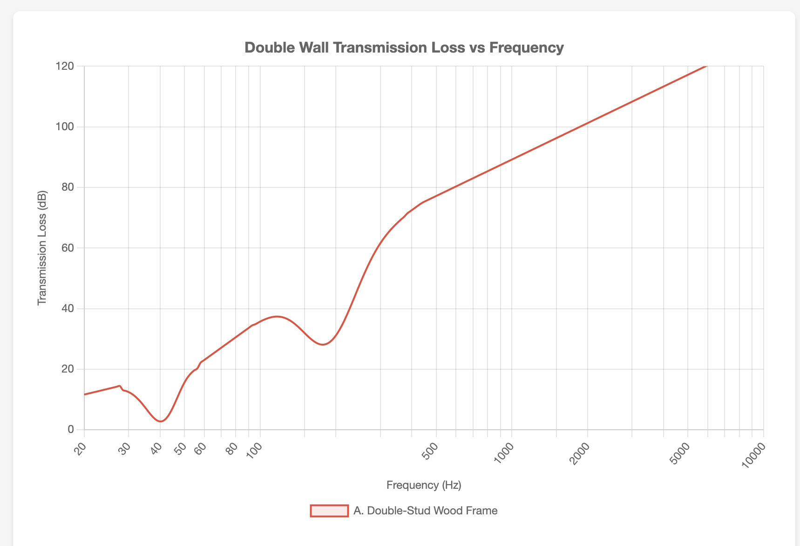

# Approach A: Double-Stud Wood Frame

Two independent 2×4 wood stud walls with an air gap between them. This is the classic Rod Gervais "Home Recording Studio: Build It Like the Pros" approach.

---

## Baseline Assembly (exterior to interior)

1. Siding
2. House wrap
3. 1/2" OSB sheathing
4. 2×4 outer studs @ 24" OC
5. R-13 fiberglass insulation
6. 1" air gap (minimum)
7. 2×4 inner studs @ 24" OC (on separate plate, no contact with outer wall)
8. R-13 fiberglass insulation
9. 2× 5/8" drywall (with Green Glue between layers)

**Key Specifications:**

| Parameter | Value |
|-----------|-------|
| Outer leaf mass | 21.4 kg/m² (4.4 lbs/ft²) |
| Inner leaf mass | 21.4 kg/m² (4.4 lbs/ft²) |
| Total mass | 42.8 kg/m² (8.8 lbs/ft²) |
| Cavity depth | 8" (3.5" + 1" gap + 3.5") |
| Estimated resonance | ~41 Hz |
| Wall thickness | ~11-12" |
| Estimated STC | 55-63 |

### Resonance Calculation

- m₁ = 21.4 kg/m², m₂ = 21.4 kg/m²
- m_eff = (21.4 × 21.4) / (21.4 + 21.4) = 10.7 kg/m²
- d = 0.2032 m (8")
- f₀ ≈ 60 / √(10.7 × 0.2032) ≈ **41 Hz**

**Transmission Loss Graph:**

---

## Sub-Variants

*To be developed — exploring different sheet good combinations, Green Glue placement, and layer counts.*

### Questions to Answer

- What happens with 3× 5/8" drywall instead of 2×?
- What if we use OSB + drywall (dissimilar materials) instead of drywall + drywall?
- Where does Green Glue provide the most benefit — between drywall layers, or between OSB and drywall?
- Is there a sub-variant that closes the gap with Approach B at the 63 Hz octave band?

---

## Pros

- True decoupling, DIY-friendly
- Familiar materials, widely available
- Good thermal performance (~R-28)
- Lighter foundation requirements
- Well-documented in studio building literature

## Cons

- Lower mass means less low-frequency isolation
- Resonance frequency (~41 Hz) is below kick drum range for this kit
- Thicker walls reduce interior space

---

## Cost Breakdown

*Based on 803 sq ft wall area (73 linear ft × 11 ft height). Prices as of January 2026.*

| Component | Quantity | Unit Cost | Total | Notes |
|-----------|----------|-----------|-------|-------|
| **Outer Wall** |||||
| 2×4 studs (8 ft) | 74 | $4.50 | $333 | 24" OC + plates |
| 2×4 top/bottom plates | 146 LF | $0.56/LF | $82 | Double top plate |
| 1/2" OSB sheathing | 26 sheets | $32 | $832 | 4×8 sheets |
| R-13 fiberglass batts | 803 SF | $0.50/SF | $402 | |
| **Inner Wall** |||||
| 2×4 studs (8 ft) | 74 | $4.50 | $333 | 24" OC + plates |
| 2×4 top/bottom plates | 146 LF | $0.56/LF | $82 | Double top plate |
| R-13 fiberglass batts | 803 SF | $0.50/SF | $402 | |
| 5/8" drywall | 52 sheets | $16 | $832 | 2 layers × 26 sheets |
| Green Glue | 52 tubes | $20 | $1,040 | 1 tube per sheet |
| **Exterior Finish** |||||
| House wrap | 803 SF | $0.15/SF | $120 | |
| Siding (LP SmartSide) | 803 SF | $1.50/SF | $1,205 | Mid-range option |
| **Fasteners/misc** | — | — | $300 | Screws, nails, tape |
| **TOTAL (DIY)** | | | **$5,963** | |
| **Framing Labor** | 1,606 SF | $5/SF | $8,030 | 2 walls × 803 SF |
| **TOTAL (Contracted)** | | | **$13,993** | |

**Price Sources:**
- 2×4 lumber: [LatestCost](https://latestcost.com/2x4-lumber-cost/) — $3.50-$6.00 retail
- OSB sheathing: [Angi](https://www.angi.com/articles/cost-of-osb-board.htm) — $32-$58/sheet
- Drywall: [HomeGuide](https://homeguide.com/costs/sheetrock-drywall-prices) — $10-$20/sheet
- R-13 insulation: [HomeAdvisor](https://www.homeadvisor.com/cost/insulation/) — $0.25-$6.75/SF
- Green Glue: [SoundAway](https://www.soundaway.com/green-glue-p/12003.htm) — ~$20/tube retail
- Framing labor: [HomeGuide](https://homeguide.com/costs/cost-to-frame-a-house) — $7-$13/SF average

---

## References

- Gervais, Rod. "Home Recording Studio: Build It Like the Pros" (2nd Edition, 2011) — double-stud wood frame reference
- [Green Glue Company - Wall Assemblies](https://www.greengluecompany.com/)
