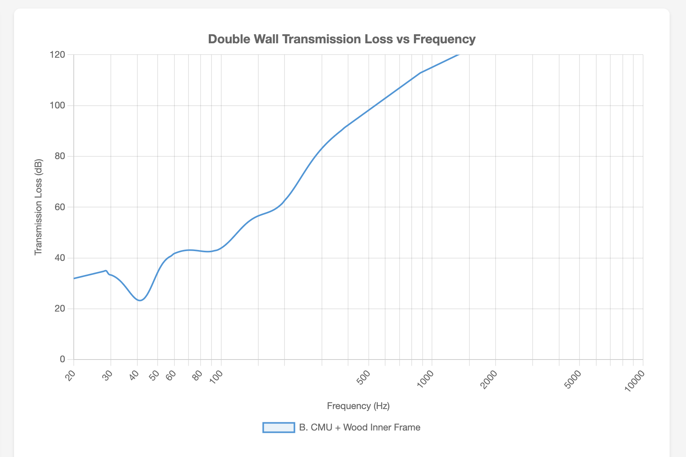

# Approach B: CMU + Decoupled Wood Inner Frame

Heavy masonry outer shell (8" CMU with cores filled with grout) with a completely decoupled wood-framed inner room.

---

## Assembly (exterior to interior)

1. Stucco, paint, or stone veneer
2. 8" CMU block (cores filled with grout for mass)
3. 4" air gap
4. 2×4 inner studs @ 24" OC (on isolation pads, no contact with outer wall)
5. R-13 mineral wool insulation
6. 2× 5/8" drywall (with Green Glue between layers)

**Key Specifications:**

| Parameter | Value |
|-----------|-------|
| Outer leaf mass | 420 kg/m² (86 lbs/ft²) |
| Inner leaf mass | 21.4 kg/m² (4.4 lbs/ft²) |
| Total mass | 441 kg/m² (90 lbs/ft²) |
| Cavity depth | 4" |
| Estimated resonance | ~42 Hz |
| Wall thickness | ~14" |
| Estimated STC | 60-68 |

### Resonance Calculation

- m₁ = 420 kg/m², m₂ = 21.4 kg/m²
- m_eff = (420 × 21.4) / (420 + 21.4) = 20.4 kg/m²
- d = 0.1016 m (4")
- f₀ ≈ 60 / √(20.4 × 0.1016) ≈ **42 Hz**

**Transmission Loss Graph:**

---

## CMU Fill Options

- **Grout (concrete):** Best structural strength, good mass
- **Sand:** Cheaper, good mass, no structural benefit
- **Perlite/vermiculite:** Lighter, adds insulation value, less mass

---

## Pros

- Excellent mass for low-frequency isolation
- Very high STC potential
- Durable, long-lasting structure
- Dissimilar materials (masonry + wood) avoid shared resonant frequencies

## Cons

- Requires masonry skills or contractor
- Heavier foundation needed
- More expensive than wood frame
- Lower thermal R-value (~R-15, needs exterior insulation)

---

## Cost Breakdown

*Based on 803 sq ft wall area (73 linear ft × 11 ft height). Prices as of January 2026.*

| Component | Quantity | Unit Cost | Total | Notes |
|-----------|----------|-----------|-------|-------|
| **Outer Wall (CMU)** |||||
| 8" CMU blocks | 803 | $2.25 | $1,807 | 1 block/SF |
| Grout fill (solid) | 2.5 CY | $150/CY | $375 | ~0.033 CF/block |
| Mortar | 20 bags | $12 | $240 | Type S, 80 lb |
| Rebar (#4) | 300 LF | $0.75/LF | $225 | Vertical + horizontal |
| **Inner Wall (Wood)** |||||
| 2×4 studs (8 ft) | 74 | $4.50 | $333 | 24" OC + plates |
| 2×4 top/bottom plates | 146 LF | $0.56/LF | $82 | Double top plate |
| R-13 fiberglass batts | 803 SF | $0.50/SF | $402 | |
| 5/8" drywall | 52 sheets | $16 | $832 | 2 layers × 26 sheets |
| Green Glue | 52 tubes | $20 | $1,040 | 1 tube per sheet |
| Isolation pads | 74 | $3 | $222 | Under each stud |
| **Exterior Finish** |||||
| Stucco (3-coat) | 803 SF | $3.00/SF | $2,409 | Materials only |
| **Fasteners/misc** | — | — | $400 | Anchors, ties, etc. |
| **TOTAL (DIY)** | | | **$8,367** | Inner wall only |
| **CMU Labor** | 803 SF | $10/SF | $8,030 | Mason contractor |
| **Inner Framing Labor** | 803 SF | $5/SF | $4,015 | Carpenter |
| **TOTAL (Contracted)** | | | **$20,412** | |

**Price Sources:**
- CMU blocks: [CountBricks](https://www.countbricks.com/post/concrete-block-prices) — $1.70-$2.45/block delivered
- CMU labor: [HomeGuide](https://homeguide.com/costs/cinder-block-wall-cost) — $5-$10/block labor
- Grout/concrete: [HomeGuide](https://homeguide.com/costs/concrete-prices) — $119-$147/CY
- Mortar: [McCoy's Building Supply](https://www.mccoys.com/shop/building-materials/pl/103105105104000000/masonry-mortar-mix) — ~$12-$17/bag
