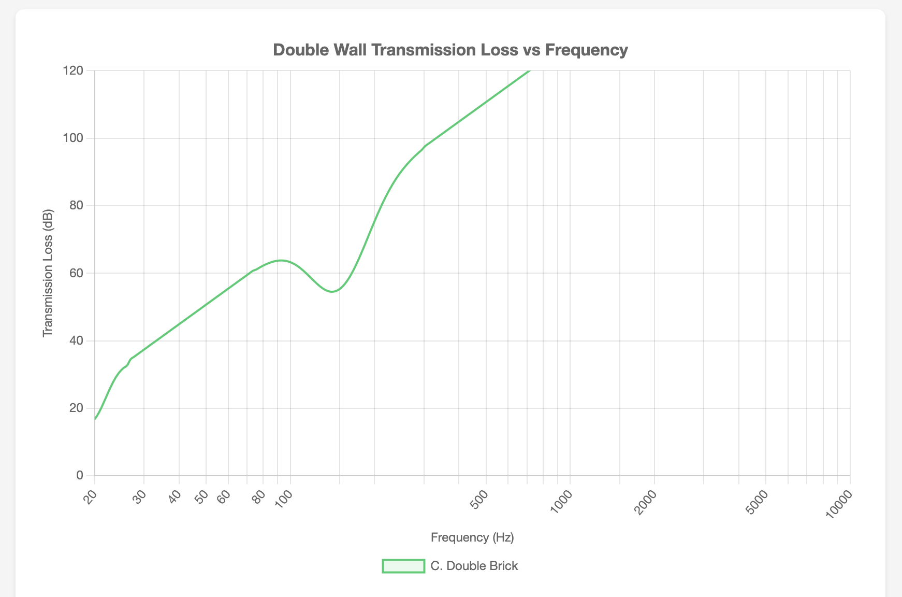

# Approach C: Double Brick

Two independent brick walls (single wythe each) with an air cavity between them.

---

## Assembly (exterior to interior)

1. Single wythe brick (outer leaf)
2. 4" air gap
3. Single wythe brick (inner leaf)
4. Furring strips + drywall (optional interior finish)

**Key Specifications:**

| Parameter | Value |
|-----------|-------|
| Outer leaf mass | 195 kg/m² (40 lbs/ft²) |
| Inner leaf mass | 195 kg/m² (40 lbs/ft²) |
| Total mass | 390 kg/m² (80 lbs/ft²) |
| Cavity depth | 4" |
| Estimated resonance | ~19 Hz |
| Wall thickness | ~12-14" |
| Estimated STC | 60-68 |

### Resonance Calculation

- m₁ = 195 kg/m², m₂ = 195 kg/m²
- m_eff = (195 × 195) / (195 + 195) = 97.5 kg/m²
- d = 0.1016 m (4")
- f₀ ≈ 60 / √(97.5 × 0.1016) ≈ **19 Hz**

**Transmission Loss Graph:**

---

## Pros

- Excellent mass on both leaves
- Very low resonance frequency (well below kick drum range)
- Aesthetic appeal
- Very high STC potential

## Cons

- Requires skilled masonry (mortar joints must be consistent)
- Most expensive option
- Heavy foundation needed
- Harder to run electrical/HVAC through solid masonry inner wall

---

## Cost Breakdown

*Based on 803 sq ft wall area (73 linear ft × 11 ft height). Prices as of January 2026.*

| Component | Quantity | Unit Cost | Total | Notes |
|-----------|----------|-----------|-------|-------|
| **Outer Brick Wythe** |||||
| Standard red brick | 5,621 | $0.55 | $3,092 | 7 bricks/SF |
| Mortar | 45 bags | $12 | $540 | Type S, 80 lb |
| Wall ties | 200 | $0.50 | $100 | Cavity ties |
| **Inner Brick Wythe** |||||
| Standard red brick | 5,621 | $0.55 | $3,092 | 7 bricks/SF |
| Mortar | 45 bags | $12 | $540 | Type S, 80 lb |
| **Interior Finish** |||||
| Furring strips (1×3) | 150 LF | $0.80/LF | $120 | For drywall attachment |
| 5/8" drywall | 26 sheets | $16 | $416 | Single layer |
| **Exterior Finish** |||||
| (Brick is finish) | — | — | $0 | |
| **Fasteners/misc** | — | — | $500 | Anchors, flashing, etc. |
| **TOTAL (DIY)** | | | **$8,400** | Materials only |
| **Brick Labor** | 1,606 SF | $15/SF | $24,090 | 2 wythes × 803 SF |
| **TOTAL (Contracted)** | | | **$32,490** | |

**Price Sources:**
- Brick: [HomeAdvisor](https://www.homeadvisor.com/cost/siding/brick-prices) — $0.35-$0.90/brick
- Brick: [HomeGuide](https://homeguide.com/costs/brick-prices) — $350-$900 per 1,000
- Brick labor: [LatestCost](https://latestcost.com/brick-cost-per-brick-price-budget/) — $9-$28/SF labor
- Brick installed: [LatestCost](https://latestcost.com/brick-cost-per-square-foot-installed/) — $9-$41/SF total
