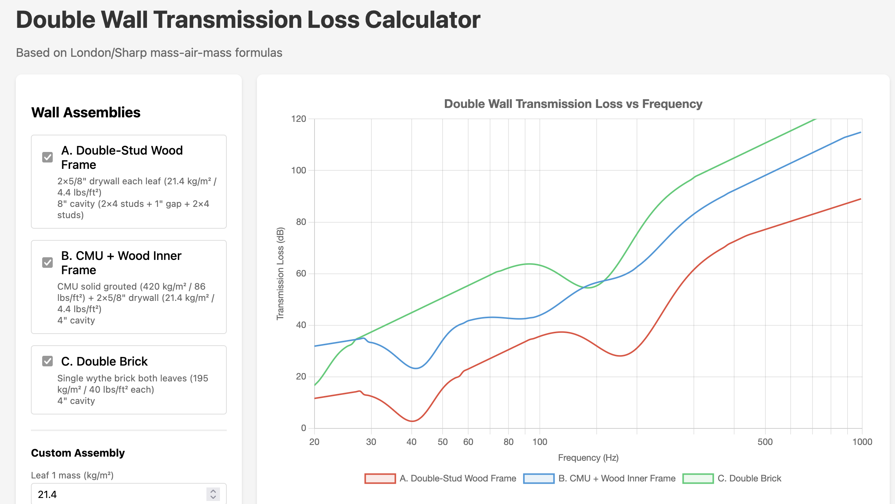

# Wall Assembly Comparison

Side-by-side analysis of all approaches.

---

## Comparison Matrix

| Approach | Total Mass | Resonance | STC | Thickness | $/SF (DIY) | $/SF (Contracted) | Foundation |
|----------|------------|-----------|-----|-----------|------------|-------------------|------------|
| **[A. Double-Stud Wood](approach-a.md)** | 43 kg/m² | ~41 Hz | 55-63 | 11-12" | $7.43 | $17.43 | Light |
| **[B. CMU + Wood Inner](approach-b.md)** | 441 kg/m² | ~42 Hz | 60-68 | 14" | —* | $25.42 | Heavy (+$2-4K) |
| **[C. Double Brick](approach-c.md)** | 390 kg/m² | ~19 Hz | 60-68 | 12-14" | —* | $40.46 | Heavy (+$2-4K) |

*\*Masonry requires contractor; DIY not practical*

### Combined Transmission Loss Comparison

### Mass Comparison

| Assembly | Total Mass | Relative TL Advantage |
|----------|------------|----------------------|
| Double-stud wood (2× drywall each leaf) | ~43 kg/m² (8.8 lbs/ft²) | Baseline |
| CMU + wood inner | ~441 kg/m² (90 lbs/ft²) | +20 dB theoretical |
| Double brick | ~390 kg/m² (80 lbs/ft²) | +19 dB theoretical |

The mass advantage of masonry is substantial, but double-wall decoupling provides additional isolation beyond what mass alone predicts.

---

## Cost Comparison Summary

| Approach | DIY | $/SF | Contracted | $/SF | Foundation |
|----------|-----|------|------------|------|------------|
| **A. Double-Stud Wood** | $5,963 | $7.43 | $13,993 | $17.43 | Light |
| **B. CMU + Wood Inner** | $8,367* | $10.42 | $20,412 | $25.42 | Heavy (+$2-4K) |
| **C. Double Brick** | $8,400* | $10.46 | $32,490 | $40.46 | Heavy (+$2-4K) |

*\*DIY for B/C = materials only; masonry requires contractor*

**Labor assumptions:**
- Framing: $5/SF (mid-range for wall framing)
- CMU: $10/SF (grouted block with rebar)
- Brick: $15/SF per wythe (skilled mason)

**Total wall cost with foundation impact:**
- A (DIY): ~$6,000 - $8,000
- A (Contracted): ~$14,000 - $16,000
- B (Contracted): ~$22,400 - $24,400
- C (Contracted): ~$34,500 - $36,500

---

## Selection Rationale

**Selection:** [TBD]

**Reasoning:** [TBD]
